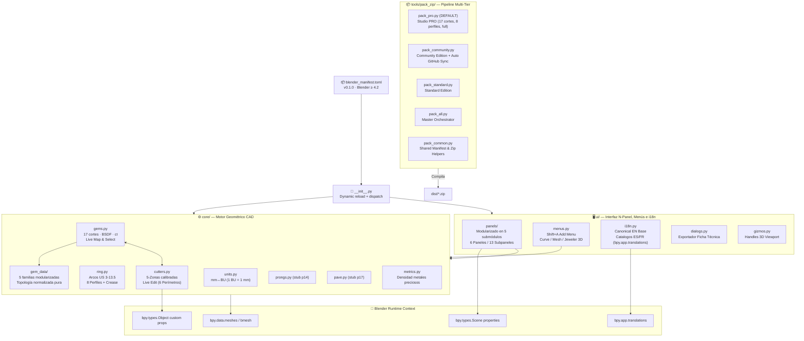
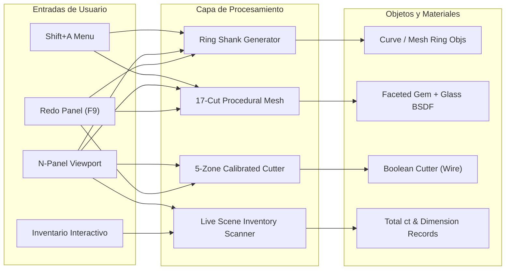
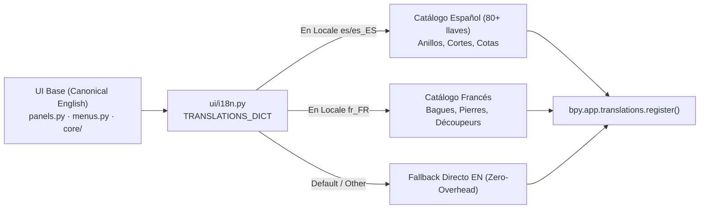
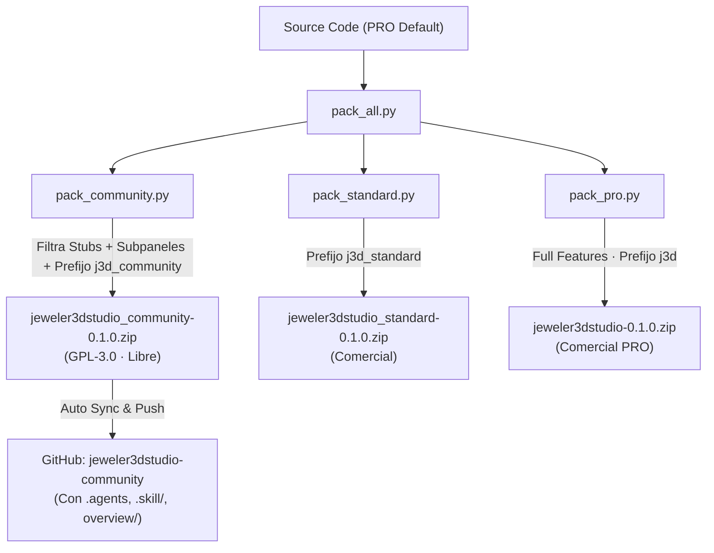

# 🏗️ Arquitectura Viva — Jeweler 3D Studio v0.1.0

> **Índice Raíz Hub & Spoke** — Cobertura 100% exhaustiva del sistema.
> Extensión Blender 4.2+ / 5.x — Joyería CAD paramétrica procedural multi-tier.

---

## 📊 Diagrama de Flujo Maestro y Dependencias

---

## 🏛️ Desglose Arquitectónico Modular (100% Cobertura)

---

## 🌐 Arquitectura de Internacionalización (i18n)

---

## 📦 Matriz de Tiers y Aislamiento de Espacios de Nombres

---

## 🔗 Subdocumentos de Arquitectura

→ [modules/cutters.md](file:///home/xolotl/dev/jeweler3dstudio/overview/architecture/modules/cutters.md) — Detalle del motor de cortadores (5 zonas, live edit, Object props)
→ [modules/gems.md](file:///home/xolotl/dev/jeweler3dstudio/overview/architecture/modules/gems.md) — Motor de gemas (17 cortes, GEM_MESH_DATA, BSDF, mapa de inventario)
→ [modules/ring.md](file:///home/xolotl/dev/jeweler3dstudio/overview/architecture/modules/ring.md) — Motor de aros y tallas
→ [modules/ui.md](file:///home/xolotl/dev/jeweler3dstudio/overview/architecture/modules/ui.md) — Interfaz N-Panel, menús Shift+A y motor i18n
→ [modules/pipeline.md](file:///home/xolotl/dev/jeweler3dstudio/overview/architecture/modules/pipeline.md) — Empaquetado multi-tier y orquestación Git

