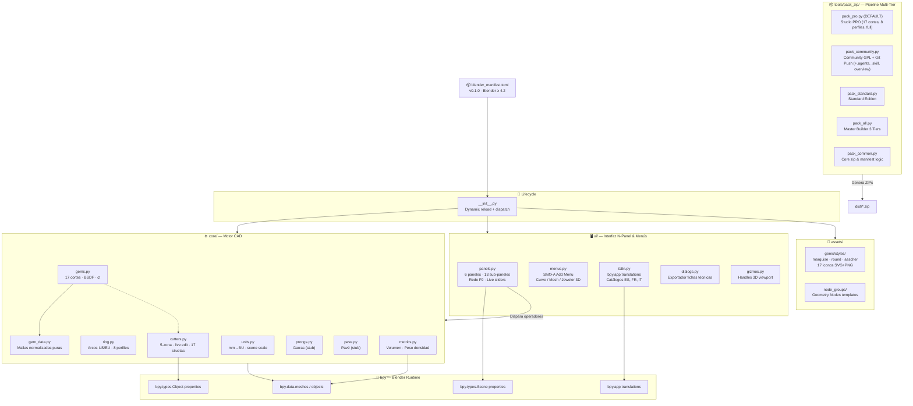

# 🏗️ Arquitectura Viva — Jeweler 3D Studio v0.1.0

> **Índice Raíz Hub & Spoke** — Actualizado 2026-09-21.
> Extensión Blender 4.2+ / 5.x — Joyería CAD paramétrica procedural multi-tier.

---

## 📊 Diagrama de Alto Nivel de Capas

---

## 🏛️ Tabla de Capas del Sistema

| Capa | Archivo / Módulo | Operadores / API Pública | Responsabilidad |
|---|---|---|---|
| **Manifest** | `blender_manifest.toml` | — | Metadatos extensión, versión mínima Blender 4.2.0 |
| **Lifecycle** | `__init__.py` | `register()`, `unregister()` | Recarga dinámica `importlib.reload()` + despacho de submódulos |
| **Units** | `core/units.py` | `mm_to_bu()`, `J3D_OT_set_scene_units` | Conversión universal mm↔BU; estándar 1 BU = 1 mm |
| **Ring** | `core/ring.py` | `J3D_OT_create_ring_size`, `J3D_OT_create_ring_profile` | Generador de aros: tallas US 3–13.5, 8 perfiles de metal, Subsurf + Edge Crease, orientación Top/Front/Side |
| **Gems** | `core/gems.py` | `J3D_OT_add_gem`, `J3D_OT_swap_gems`, `create_gem_mesh()`, `calculate_carats()` | Motor geométrico 17 cortes, materiales BSDF, estimador ct, mapa de inventario de escena, intercambiador |
| **Gem Data** | `core/gem_data.py` | `GEM_MESH_DATA` | Topología normalizada pura (vértices + caras) para los 17 cortes — sin dependencias de bpy |
| **Cutters** | `core/cutters.py` | `J3D_OT_add_cutter_to_gem`, `J3D_OT_reset_cutter_defaults`, `create_cutter_mesh()`, `rebuild_cutter_for_gem()`, `find_cutter_for_gem()` | Cortadores booleanos 5-zona con perfil calibrado (STL de joyería GIA); 17 siluetas; edición en vivo de 6 perímetros vía Object props + Redo F9 |
| **Prongs** | `core/prongs.py` | `J3D_OT_add_prongs` (stub) | Garras paramétricas — pendiente implementación completa (`p14`) |
| **Pavé** | `core/pave.py` | `J3D_OT_create_pave` (stub) | Distribución pavé sobre curva/superficie — pendiente (`p17`) |
| **Metrics** | `core/metrics.py` | `calculate_mesh_volume_cm3()` | Volumen bmesh y peso estimado en metales preciosos (Oro 24/18/14K, Pt, Ag, Ti) |
| **UI Panels** | `ui/panels.py` | 6 paneles raíz + 13 sub-paneles | N-Panel "Jeweler 3D": Anillo/Talla, Gemas, Cortadores, Engastes, Canastas, Métricas; Redo F9 en todos los operadores de creación |
| **UI Menus** | `ui/menus.py` | `VIEW3D_MT_j3d_add_menu` | Integración `Shift+A` (Add Menu) para Curve, Mesh y categoría Jeweler 3D |
| **UI i18n** | `ui/i18n.py` | `translate()`, `register()`, `unregister()` | Conexión con `bpy.app.translations` para catálogos multi-idioma (ES, FR, IT) |
| **UI Dialogs** | `ui/dialogs.py` | `J3D_OT_export_report` | Exportador modal de ficha técnica (peso, volumen, inventario) |
| **UI Gizmos** | `ui/gizmos.py` | `J3D_GGT_gem_controls` | Handles interactivos 3D en viewport para gemas/cortadores |
| **Packaging Multi-Tier** | `tools/pack_zip/` | `pack_pro.py`, `pack_community.py`, `pack_standard.py`, `pack_all.py` | Empaquetado aislado por edición (Studio PRO default, Standard, Community con auto-push GitHub) |
| **Assets — Icons** | `assets/gems/styles/` | `get_cut_preview_collection()` | 17 iconos SVG+PNG por estilo (marquise/round/asscher) conectados a `bpy.utils.previews` |
| **Assets — Nodes** | `assets/node_groups/` | Geometry Nodes | Plantillas de nodos no destructivos |

---

## 🔗 Subdocumentos de Arquitectura

→ [modules/cutters.md](file:///home/xolotl/dev/jeweler3dstudio/overview/architecture/modules/cutters.md) — Detalle del motor de cortadores (5 zonas, live edit, Object props)
→ [modules/gems.md](file:///home/xolotl/dev/jeweler3dstudio/overview/architecture/modules/gems.md) — Motor de gemas (17 cortes, GEM_MESH_DATA, BSDF, mapa de inventario)
→ [modules/ring.md](file:///home/xolotl/dev/jeweler3dstudio/overview/architecture/modules/ring.md) — Motor de aros y tallas

---

## ⚠️ Deuda Técnica Relevante

| Módulo | Deuda | Ref |
|---|---|---|
| `gem_data.py` | 2588 líneas de datos puros — candidato a split en subarchivos por familia de corte | — |
| `cutters.py` | 821 líneas — creció con live-edit; candidato a separar `cutters_ui.py` de `cutters_core.py` | `d8` |
| `gems.py` | 806 líneas — `J3D_OT_swap_gems`, mapa de inventario y motor geométrico en un solo archivo | `d5` |
| `ui/panels.py` | 748 líneas — candidato a modularizar subpaneles temáticos | `d2` |
| `prongs.py`, `pave.py` | Stubs sin implementación real; exponen operadores no funcionales | `p14`, `p17` (`d9`, `d10`) |
| Booleanos | Sin integración de auto-boolean (1-click Modifier apply) | `p18` |

