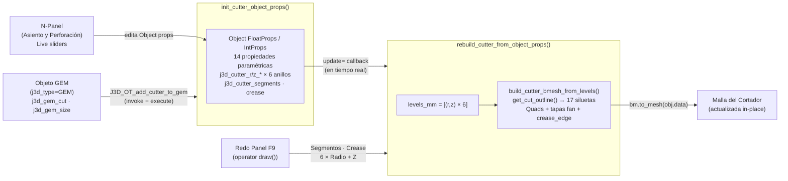

# ⚙️ Módulo: Cutters — Motor de Cortadores Booleanos

> **Archivo:** [`core/cutters.py`](file:///c:/Users/termo/Documents/GitHub/jeweler3dstudio/core/cutters.py) — 822 líneas
> **Rol:** Generador de cortadores booleanos para asientos de gema — 5 zonas, 17 siluetas, edición en vivo.

---

## Flujo de Datos

---

## 5 Zonas del Perfil

| Zona | Descripción | Radio Ratio | Z Ratio |
|---|---|---|---|
| 1 — Cima Superior | Tubo cilíndrico por encima de la tabla | `CUTTER_R_TABLE` = 0.635 | `+CUTTER_TOP_RATIO` = +0.576 |
| 2 — Tabla / Corona | Transición cónica corona → girdle | `CUTTER_R_TABLE` = 0.635 | `+CUTTER_TABLE_RATIO` = +0.210 |
| 3 — Filetín Superior | Borde superior del girdle | `CUTTER_R_GIRDLE` = 1.045 | `+CUTTER_GIRDLE_TOP_RATIO` = +0.048 |
| 4 — Filetín Inferior | Borde inferior / cono de asiento | `CUTTER_R_GIRDLE` = 1.045 | `CUTTER_GIRDLE_BOT_RATIO` = −0.026 |
| 5 — Asiento Pabellón | Cono de pabellón | `CUTTER_R_HOLE` = 0.488 | `CUTTER_SEAT_RATIO` = −0.266 |
| 6 — Perforación | Canal inferior de luz | `CUTTER_R_HOLE` = 0.488 | `−CUTTER_DEPTH_RATIO` = −1.010 |

> Ratios son `× size_mm × 0.5` para radio y `× size_mm` para Z (1 BU = 1 mm).

---

## Siluetas 2D por Familia de Corte

| Función | Cortes |
|---|---|
| `_circle()` | ROUND |
| `_superellipse(p=4.5, a=b=1)` | PRINCESS, ASSCHER, SQUARE, FLANDERS, OCTAGON |
| `_superellipse(p=4.5, b=0.58)` | BAGUETTE, EMERALD, RADIANT |
| `_ellipse(b=0.72)` | OVAL, CUSHION |
| `_pear()` | PEAR |
| `_marquise()` | MARQUISE |
| `_heart()` | HEART |
| `_triangle_rounded()` | TRILLION, TRILLIANT, TRIANGLE |

---

## Object Properties Registradas en `bpy.types.Object`

| Prop | Tipo | Default | Update |
|---|---|---|---|
| `j3d_cutter_segments` | `IntProperty` | 8 | ✅ live |
| `j3d_cutter_crease` | `FloatProperty` | 0.8 | ✅ live |
| `j3d_cutter_r/z_top` | `FloatProperty` | auto | ✅ live |
| `j3d_cutter_r/z_table` | `FloatProperty` | auto | ✅ live |
| `j3d_cutter_r/z_girdle_top` | `FloatProperty` | auto | ✅ live |
| `j3d_cutter_r/z_girdle_bot` | `FloatProperty` | auto | ✅ live |
| `j3d_cutter_r/z_seat` | `FloatProperty` | auto | ✅ live |
| `j3d_cutter_r/z_hole_bot` | `FloatProperty` | auto | ✅ live |

---

## Operadores

| Operador | `bl_idname` | Notas |
|---|---|---|
| `J3D_OT_add_cutter_to_gem` | `j3d.add_cutter_to_gem` | Crea o regenera cortador; soporta Redo F9 con 14 parámetros |
| `J3D_OT_reset_cutter_defaults` | `j3d.reset_cutter_defaults` | Restablece los 6 perímetros a proporciones GIA estándar |
| `J3D_OT_add_cutters` | `j3d.add_cutters` | Delegador: llama `add_cutter_to_gem` si hay gema, si no añade cilindro base |

---

## Deuda Técnica

- **822 líneas** — Separar `cutters_core.py` (BMesh, algoritmos, constantes) de `cutters_ui.py` (Operator classes, props, callbacks).
- El guard `_UPDATING_CUTTER` es global — no thread-safe si Blender usara múltiples contextos.
