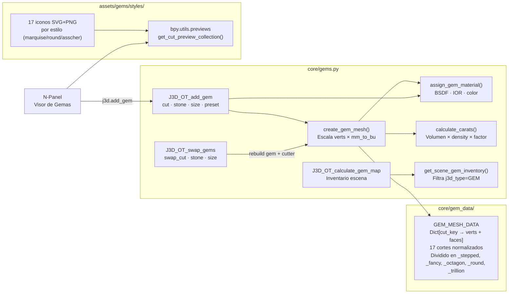

# 💎 Módulo: Gems — Motor de Gemas Paramétricas

> **Archivos:** [`core/gems.py`](file:///home/xolotl/dev/jeweler3dstudio/core/gems.py) (746L) + [`core/gem_data/`](file:///home/xolotl/dev/jeweler3dstudio/core/gem_data/) (subpaquete 5 módulos, ~2600L)
> **Rol:** Generador procedural de gemas 3D, materiales BSDF, estimador de quilates, mapa de inventario e intercambiador.

---

## Diagrama de Componentes

---

## 17 Cortes Estándar

| Familia | Cortes | `GEM_MESH_DATA` Key |
|---|---|---|
| Redondo | ROUND | ✅ |
| Oval / Cojín | OVAL, CUSHION | ✅ |
| Pera | PEAR | ✅ |
| Marquesa | MARQUISE | ✅ |
| Corazón | HEART | ✅ |
| Trillón | TRILLION, TRILLIANT, TRIANGLE | ✅ |
| Rectang. escalonado | EMERALD, ASSCHER, BAGUETTE | ✅ |
| Rectang. brillante | PRINCESS, SQUARE, RADIANT, FLANDERS, OCTAGON | ✅ |

---

## Piedras Preciosas y Propiedades Físicas

| Piedra | IOR | Densidad g/cm³ | Color |
|---|---|---|---|
| DIAMOND | 2.417 | 3.52 | Blanco |
| RUBY | 1.770 | 4.02 | Rojo |
| SAPPHIRE | 1.770 | 4.02 | Azul |
| EMERALD | 1.580 | 2.76 | Verde |
| AQUAMARINE | 1.575 | 2.72 | Celeste |
| AMETHYST | 1.544 | 2.65 | Violeta |
| CUBIC_ZIRCONIA | 2.150 | 5.65 | Cristal |
| MOISSANITE | 2.650 | 3.22 | Cristal |
| MORGANITE | 1.580 | 2.76 | Rosa |
| TANZANITE | 1.695 | 3.35 | Violeta azul |

---

## Custom Properties en `bpy.types.Object` (Gema)

| Prop | Valor | Descripción |
|---|---|---|
| `j3d_type` | `"GEM"` | Identificador de tipo de objeto |
| `j3d_gem_cut` | `str` | Código de corte (ROUND, OVAL…) |
| `j3d_gem_stone` | `str` | Material de piedra |
| `j3d_gem_size` | `float` | Calibre en mm |
| `j3d_carat` | `float` | Quilates estimados |
| `j3d_has_cutter` | `str` | Nombre del cortador asociado (→ `CTR_*`) |

---

## Deuda Técnica

- **Calibres elongados** (Oval, Pear, Marquise) usan solo un eje — falta campo `size_w_mm` para L×W (p10).
- **Preset EnumProperty** no se resetea al cambiar de corte — bug de contexto dinámico en Blender (p11).
