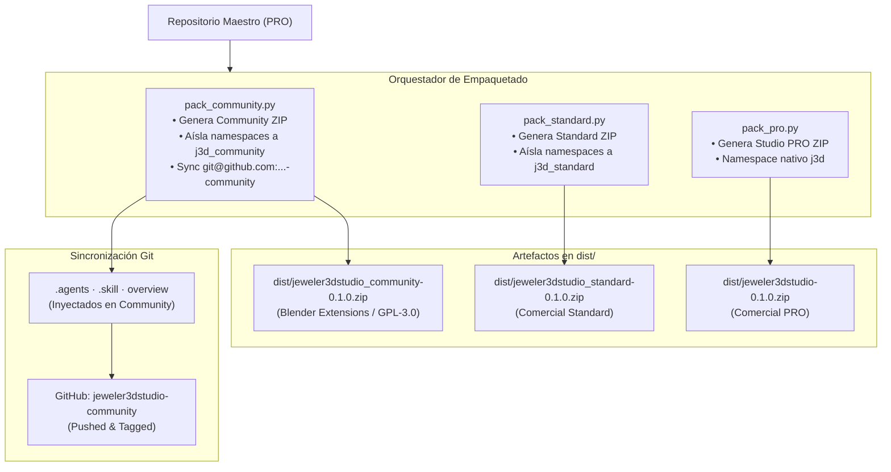

# 📦 Módulo: Pipeline — Empaquetado Multi-Tier y Distribución

> **Archivos:** [`tools/pack_zip/pack_all.py`](file:///home/xolotl/dev/jeweler3dstudio/tools/pack_zip/pack_all.py), [`tools/pack_zip/pack_community.py`](file:///home/xolotl/dev/jeweler3dstudio/tools/pack_zip/pack_community.py), [`tools/pack_zip/pack_pro.py`](file:///home/xolotl/dev/jeweler3dstudio/tools/pack_zip/pack_pro.py), [`tools/pack_zip/pack_standard.py`](file:///home/xolotl/dev/jeweler3dstudio/tools/pack_zip/pack_standard.py), [`tools/pack_zip/pack_common.py`](file:///home/xolotl/dev/jeweler3dstudio/tools/pack_zip/pack_common.py)
> **Rol:** Generador de artefactos ZIP y sincronización automatizada de repositorios Git para Blender Extensions y canales comerciales.

---

## Diagrama del Pipeline de Distribución

---

## Especificaciones de Tiers

| Tier | Archivo Zip | Namespace | Destino | Licencia |
|---|---|---|---|---|
| **Community** | `jeweler3dstudio_community-0.1.0.zip` | `j3d_community` | extensions.blender.org | GPL-3.0-or-later |
| **Standard** | `jeweler3dstudio_standard-0.1.0.zip` | `j3d_standard` | Gumroad / BlenderMarket | Comercial |
| **Studio PRO** | `jeweler3dstudio-0.1.0.zip` | `j3d` | Gumroad / BlenderMarket PRO | Comercial |
