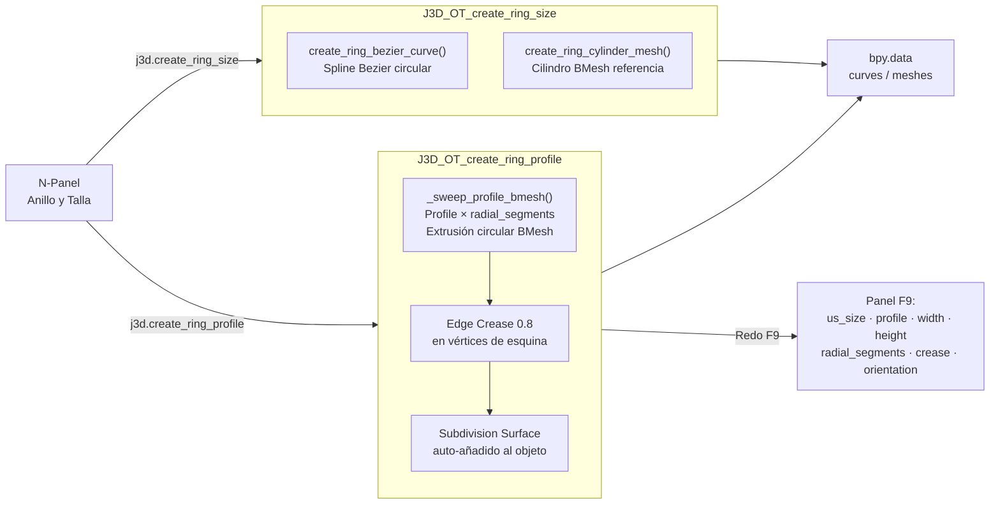

# 💍 Módulo: Ring — Motor de Aros y Tallas

> **Archivo:** [`core/ring.py`](file:///c:/Users/termo/Documents/GitHub/jeweler3dstudio/core/ring.py) — 588 líneas
> **Rol:** Generador paramétrico de aros de joyería: tallas US, 8 perfiles de metal, Subdivision Surface y orientación.

---

## Diagrama de Flujo

---

## Tallas US Soportadas

Rango: US 3.0 a 13.5 (23 tallas con medias tallas). Default: US 7.0 = 17.32 mm diámetro interior.

## 8 Perfiles de Metal

| Perfil | Clave | Descripción |
|---|---|---|
| Media Caña | `MEDIA_CANA` | Semicírculo — el más común en joyería |
| Plano | `PLANO` | Rectangular liso |
| Confort | `COMFORT` | Interior redondeado para comodidad |
| Oval | `OVAL` | Sección elíptica |
| Filo | `FILO` | Cuña angular afilada |
| Europeo | `EUROPEO` | Cantos vivos, interior plano |
| Biseado | `BISEADO` | Plano con chaflán superior |
| Cóncavo | `CONCAVO` | Interior convexo cóncavo |

## Propiedades del Redo Panel (F9)

| Prop | Default | Rango |
|---|---|---|
| `us_size` | "7.0" | 3.0 – 13.5 |
| `profile_type` | MEDIA_CANA | 8 perfiles |
| `orientation` | FRONT | Top/Front/Side |
| `width_mm` | 3.0 mm | 1.0 – 20.0 |
| `height_mm` | 1.5 mm | 0.3 – 10.0 |
| `radial_segments` | 16 | 8 – 256 |
| `profile_segments` | 2 | 2 – 64 |
| `use_subsurf` | True | — |
| `subsurf_levels` | 2 | 1 – 4 |
| `crease` | 0.8 | 0.0 – 1.0 |

## Deuda Técnica

- Sin soporte de **Aros cónicos / tapered shank** (grosor variable a lo largo del arco) — (p12).
- `ring.py` tiene 588 líneas; los 8 perfiles son inline — candidato a tabla de datos o diccionario externo.
