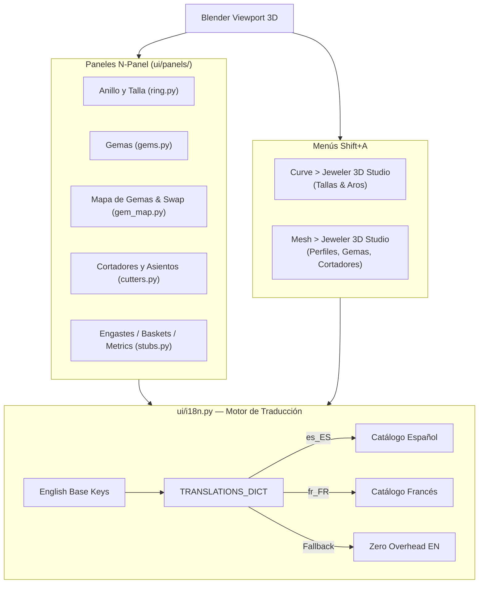

# 🖥️ Módulo: UI — Interfaz N-Panel, Menús e Internacionalización

> **Archivos:** [`ui/panels/`](file:///home/xolotl/dev/jeweler3dstudio/ui/panels/) (subpaquete: `ring.py`, `gems.py`, `gem_map.py`, `cutters.py`, `stubs.py`, `__init__.py`), [`ui/menus.py`](file:///home/xolotl/dev/jeweler3dstudio/ui/menus.py), [`ui/i18n.py`](file:///home/xolotl/dev/jeweler3dstudio/ui/i18n.py)
> **Rol:** Capa visual interactiva para Blender 4.2+, gestión del menú Shift+A, N-Panel contextual y motor de traducciones `bpy.app.translations`.

---

## Diagrama de Interacción UI

---

## Estructura de Paneles (`ui/panels/`)

| Panel | `bl_idname` | Contexto / Visibilidad |
|---|---|---|
| Anillo y Talla | `J3D_PT_ring_builder` | Siempre visible en tab `Jeweler 3D` |
| Selector de Gema | `J3D_PT_gems` | Con preview de 17 cortes + presets |
| Cortadores / Asientos | `J3D_PT_cutters` | Contextual: se activa si hay gema o cortador seleccionado |
| Inventario de Gemas | `J3D_PT_gem_map` | Tabla dinámica con conteo de quilates y dimensiones |
| Garras (Prongs) | `J3D_PT_prongs` | Paramétrico (PRO / Stub) |
| Pavé | `J3D_PT_pave` | Distribución sobre superficie (PRO / Stub) |

---

## Engine i18n (`ui/i18n.py`)

- **Registro**: `bpy.app.translations.register(__name__, TRANSLATIONS_DICT)`
- **Desregistro**: `bpy.app.translations.unregister(__name__)`
- **Idiomas Soportados**: `en_US` (Base), `es_ES` / `es` (Español), `fr_FR` (Francés).
