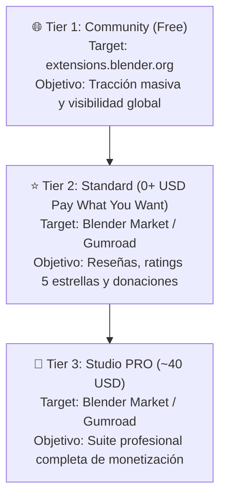

# 📦 Plan de Distribución y Monetización (3-Tier) — Sugerencias

> [!NOTE]
> **Estado del documento:** 📌 *Sugerencia y propuesta estratégica preliminar.*
> La definición final y división exacta de qué features contendrá cada versión se determinará al concluir el desarrollo completo de la suite.

---

## 🎯 Visión General: Embudo de 3 Niveles (3-Tier Funnel)



---

## 📋 Propuesta de División de Features (3 Tiers)

| Feature / Módulo | 🌐 Tier 1: Community (`blender.org`) | ⭐ Tier 2: Standard (`$0+` Blender Market) | 💎 Tier 3: Studio PRO (`~$40 USD`) |
|---|---|---|---|
| **Precio sugerido** | **$0 (Gratuito / GPL)** | **$0+ (Pay what you want)** | **$40 USD** (Comercial) |
| **Plataforma principal** | Catálogo oficial Blender 4.2+ | Blender Market / Gumroad | Blender Market / Gumroad |
| **Integración `Shift+A` (Add Menu)** | ❌ Inactivo (solo N-Panel) | 🟡 Menús básicos | ✅ Completo (Curve, Mesh, Jeweler 3D + Redo F9) |
| **Tallas de Anillo (US 3.0–13.5)** | ✅ **Todas las tallas** (Curva + Cilindro) | ✅ **Todas las tallas** (Curva + Cilindro) | ✅ **Todas las tallas** + Redo Panel + Menú Shift+A |
| **Perfiles de Metal Paramétricos** | 3 perfiles (Media Caña, Plano, Confort) | 5 perfiles estándar | ✅ **8 perfiles completos** + Subsurf + Crease (0.8) |
| **Catálogo de Piedras (Materiales BSDF)** | ✅ Piedras base (Diamante, Rubí, Zafiro, Esmeralda, Tanzanita, etc.) | ✅ Piedras base + personalizadas | ✅ Catálogo completo + Materiales Procedurales Pro |
| **Cortes de Gemas (Mallas 3D)** | Cortes básicos | Cortes estándar (6 cortes) | ✅ **17 cortes estándar completos** GIA/ISO |
| **Mapa de Gemas (Inventario de Escena)** | ❌ No incluido | ✅ **Sí incluido** (tabla, conteo y quilates totales) | ✅ **Completo** (tabla + totales + Swap Gems) |
| **Selector de Gemas & Resaltado en Vivo** | ❌ No | ❌ No | ✅ **Interactivo bidireccional** (`j3d.select_gems` + `box.box()` / `RADIOBUT_ON`) |
| **Cortadores Booleanos** | ❌ No | Cortador simple (1 zona) | ✅ **5 zonas calibrado** + Live Edit 6 perímetros |
| **Engastes (Garras / Prongs)** | ❌ No | Garras básicas (4 garras redondas) | ✅ Garras paramétricas V/chevron, 4/6/8 + F9 |
| **Bisel (Bezel) & Canastas** | ❌ No | ❌ No | ✅ Bisel cerrado + Galerías de alambre |
| **Distribución Pavé** | ❌ No | ❌ No | ✅ Pavé paramétrico continuo sobre curva |
| **Auto-Boolean (1-Click)** | ❌ No | ❌ No | ✅ 1-Click Apply Cutters to Metal |
| **Métricas & Cotizador Administrativo** | ❌ No | ❌ No | ✅ **Exclusivo Pro** (Volumen cm³, $/g metal, gemas, mano de obra y ficha técnica) |
| **Verificador Fundición / STL** | ❌ No | ❌ No | ✅ Check grosor <0.6mm + Exportador merma % |


---

## 🛠️ Arquitectura de Repositorios y Automatización (Zero-Doble Trabajo)

Para evitar duplicar código y mantener un desarrollo ágil y seguro:

### 1. Estructura de Repositorios en GitHub

```
[GitHub Repo PRIVADO] (jeweler3dstudio)
   │  • Monorepo de desarrollo activo (Suite PRO completa)
   │  • Contiene código de 17 cortes, cortadores 5 zonas, garras, pavé y agentes
   │  • Destino de venta directa: Blender Market / Gumroad
   │
   ▼ (Ejecución de script: python pack_extension.py --tier community)
[GitHub Repo PÚBLICO] (jeweler3dstudio-community)
      • Requisito obligatorio para publicar en extensions.blender.org
      • Código filtrado automáticamente (solo tallas + cortes básicos)
      • Vitrina de tráfico masivo + Tracker público de Issues / Sugerencias
```

### 2. Cumplimiento de Licencia GPL y Monetización

- **La API de Blender exige licencia GPL-2.0+**, pero **GPL autoriza legalmente el cobro comercial**.
- No existe obligación de regalar el código fuente ni los archivos `.zip` a personas que no hayan adquirido el producto.
- Solo los clientes que compran en Blender Market o Gumroad reciben el archivo empaquetado `.zip` y las actualizaciones oficiales.

---

## 🚀 Embudo de Conversión en la Interfaz (UI Marketing)

En la versión **Tier 1: Community** (`extensions.blender.org`), la interfaz incluirá:
- **Banners elegantes no intrusivos**: En subpaneles avanzados (Cortadores, Engastes, Mapa de Gemas), mostrar botones con enlace directo: `[💎 Desbloquear 17 Cortes & Cortadores 5-Zonas en Blender Market]`.
- **README y documentación pública**: Enlaces de compra destacados hacia Blender Market y Gumroad con capturas y videos de demostración.

---

## 📦 Pipeline de Empaquetado Propuesto (`pack_extension.py`)

El script `pack_extension.py` generará automáticamente las variantes desde este único código fuente mediante filtros:

- `dist/jeweler3dstudio-community-0.1.0.zip` (Para `extensions.blender.org` y repo público)
- `dist/jeweler3dstudio-standard-0.1.0.zip` (Para Blender Market `$0+` / Donaciones)
- `dist/jeweler3dstudio-pro-0.1.0.zip` (Para Blender Market / Gumroad `$40 USD`)

---

## 📌 Próximos Pasos

1. Mantener este repositorio actual en estado **Privado** en GitHub.
2. Continuar construyendo todas las funcionalidades de la suite en el código fuente (`core/prongs.py`, `core/pave.py`, cortadores booleanos, etc.).
3. Al finalizar el backlog, implementar los filtros por tier en `pack_extension.py` y crear el repo público de la versión Community para `extensions.blender.org`.

