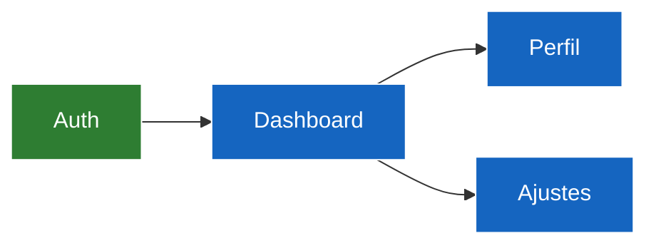

# Tracker: arquitectura y rutas

## Mapa de navegación

`done` = auditado · `active` = en trabajo actual · `pending` = pendiente (fill `#c62828`).

---

## Componentes por capa

| ID | Capa | Componente / Archivo | Estado | Notas |
|---|---|---|---|---|
| a1 | Presentation | | activo | |
| a2 | Domain | | activo | |
| a3 | Data | | activo | |

Estados: `activo`, `refactor pendiente`, `deprecado`, `bloqueado`.

---

## Dependencias externas relevantes

| Paquete | Versión fijada | Propósito | Estado |
|---|---|---|---|
| | | | `ok` / `desactualizado` / `conflicto` |

---

## Decisiones de arquitectura (ADR mínimo)

<!-- Registrar decisiones significativas para que Agentes entrantes entiendan el "por qué" sin reabrir discusiones resueltas. -->

### [YYYY-MM-DD] [Título de la decisión]

- **Contexto:** …
- **Decisión tomada:** …
- **Consecuencias / trade-offs:** …
- **Agente que decidió:** [firma — ver `core/communication.md §3`]

---

> **Deuda técnica** → `overview/work/deuda_tecnica.md` (backlog canónico único; no registrar aquí).
