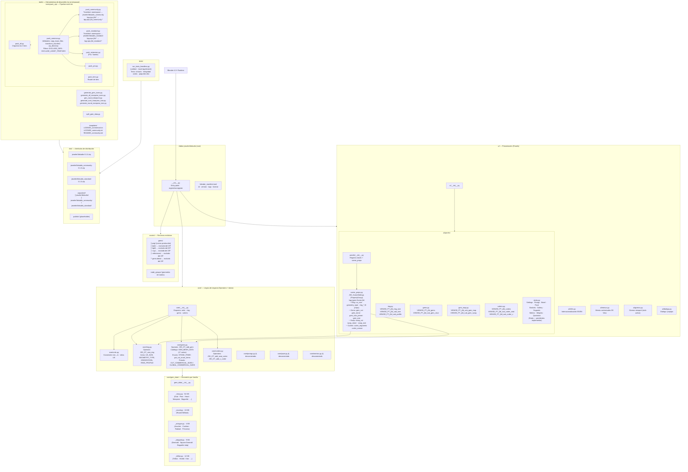
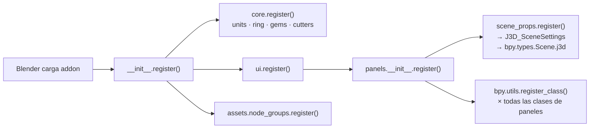
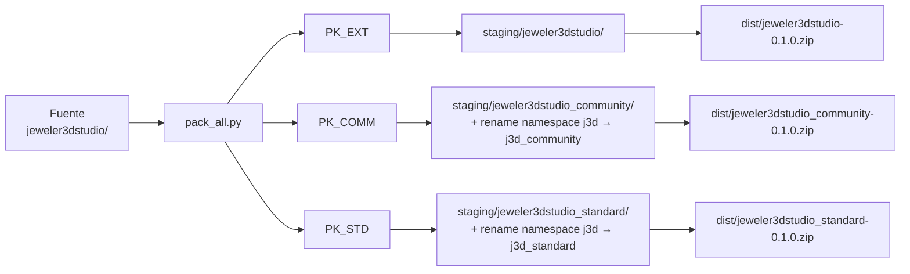

# Arquitectura — Jeweler 3D Studio
> Última actualización: 2026-09-22 · Cobertura: 100 %

---

## Diagrama general (capas)

---

## Diagrama de flujo de registro (Blender lifecycle)

---

## Diagrama multi-tier packaging

---

## Componentes por capa

| ID | Capa | Archivo | Estado | Notas |
|---|---|---|---|---|
| a01 | Entry Point | `__init__.py` | ✅ activo | Registro dinámico con reload |
| a02 | Manifest | `blender_manifest.toml` | ✅ activo | v0.1.1 · Blender 4.2+ |
| a03 | Core | `core/units.py` | ✅ activo | Conversión mm/in/tallas |
| a04 | Core | `core/ring.py` | ✅ activo | Operator + enums ring |
| a05 | Core | `core/gems.py` | ✅ activo | Operator + 17 cortes |
| a06 | Core | `core/cutters.py` | ✅ activo | Seat + V cutters |
| a07 | Core | `core/gem_data/_fancy.py` | ✅ activo | Familia fancy (54 KB) |
| a08 | Core | `core/gem_data/_round.py` | ✅ activo | Round Brilliant |
| a09 | Core | `core/gem_data/_octagon.py` | ✅ activo | Asscher/Cushion/Radiant |
| a10 | Core | `core/gem_data/_stepped.py` | ✅ activo | Emerald/Baguette step |
| a11 | Core | `core/gem_data/_trillion.py` | ✅ activo | Trillion/Shield/Kite |
| a12 | Core | `core/prongs.py` | ⚠️ desconectado | Comentado en core/__init__ |
| a13 | Core | `core/pave.py` | ⚠️ desconectado | Comentado en core/__init__ |
| a14 | Core | `core/metrics.py` | ⚠️ desconectado | Comentado en core/__init__ |
| a15 | UI Props | `ui/panels/scene_props.py` | ✅ activo | 20 props en scene.j3d.* |
| a16 | UI Panel | `ui/panels/ring.py` | ✅ activo | 3 paneles N-Panel |
| a17 | UI Panel | `ui/panels/gems.py` | ✅ activo | 2 paneles + icon pcoll |
| a18 | UI Panel | `ui/panels/gem_map.py` | ✅ activo | 2 subpaneles |
| a19 | UI Panel | `ui/panels/cutters.py` | ✅ activo | 3 paneles |
| a20 | UI Panel | `ui/panels/stubs.py` | ⚠️ stubs | 10 paneles placeholder |
| a21 | UI | `ui/i18n.py` | ✅ activo | Traducciones ES/EN |
| a22 | UI | `ui/menus.py` | ✅ activo | Menús contextuales |
| a23 | UI | `ui/gizmos.py` | ⚠️ stub | Gizmos pendientes |
| a24 | UI | `ui/dialogs.py` | ✅ activo | Popups |
| a25 | Assets | `assets/gems/png/` | ✅ activo | Iconos de cortes (PNG) |
| a26 | Assets | `assets/node_groups/` | ✅ activo | Geometría nodos |
| a27 | Dist | `dist/*.zip` (3 tiers) | ✅ generado | Pro · Standard · Community |
| a28 | Tools | `tools/pack_zip/pack_*.py` | ✅ activo | Pipeline multi-tier |
| a29 | Tools | `tools/generate_gem_icons.py` | ✅ activo | Generación de iconos |
| a30 | Tools | `tools/split_gem_data.py` | ✅ activo | Fragmentación gem_data |
| a31 | Tests | `tests/run_tests_headless.py` | ✅ activo | CI headless unittest |

---

## Dependencias externas

| Módulo | Origen | Propósito | Estado |
|---|---|---|---|
| `bpy` | Blender runtime | API principal — tipos, propiedades, ops | ✅ ok |
| `bmesh` | Blender runtime | Manipulación de malla en memoria | ✅ ok |
| `bpy.props` | Blender runtime | Sistema de propiedades declarativas | ✅ ok |
| `mathutils` | Blender runtime | Vectores, matrices, geometría | ✅ ok |
| `zipfile`, `shutil`, `pathlib` | stdlib | Pipeline de empaquetado | ✅ ok |
| `unittest`, `unittest.mock` | stdlib | Suite headless tests | ✅ ok |

---

## Decisiones de arquitectura (ADR)

### 2026-09-22 — PropertyGroup unificado `scene.j3d.*`
- **Contexto:** Las propiedades de escena vivían como atributos sueltos en `bpy.types.Scene`.
- **Decisión:** Consolidar en `J3D_SceneSettings(PropertyGroup)` → `bpy.types.Scene.j3d`.
- **Consecuencias:** Acceso uniforme `context.scene.j3d.*`; simplifica empaquetado multi-tier; elimina colisiones de namespace entre extensiones coexistentes.
- **Agente:** Antigravity · sesión w59

### 2026-09-22 — Regex quirúrgico en transformación multi-tier
- **Contexto:** El regex de reemplazo `j3d → j3d_community` era demasiado amplio y colisionaba con la variable local `j3d = context.scene.j3d`.
- **Decisión:** Ajustar regex a `bpy\.ops\.j3d\.` y strings literales de operadores, nunca reemplazar identificadores Python genéricos.
- **Consecuencias:** Protege variables de acceso a PropertyGroup; evita `NameError` en runtime.
- **Agente:** Antigravity · sesión w61

### 2026-09-22 — Suite headless `tests/run_tests_headless.py`
- **Contexto:** No existe ejecutable de Blender en el entorno CI.
- **Decisión:** Usar `unittest.mock` con jerarquía de módulos ficticios (`bpy`, `bmesh`) para validar sintaxis e integridad estática.
- **Consecuencias:** Detecta regresiones de packaging sin necesitar Blender instalado; metaclass conflicts resueltos con clases dummy distintas.
- **Agente:** Antigravity · sesión w60

---

> **Deuda técnica** → [`overview/work/deuda_tecnica.md`](../work/deuda_tecnica.md)
